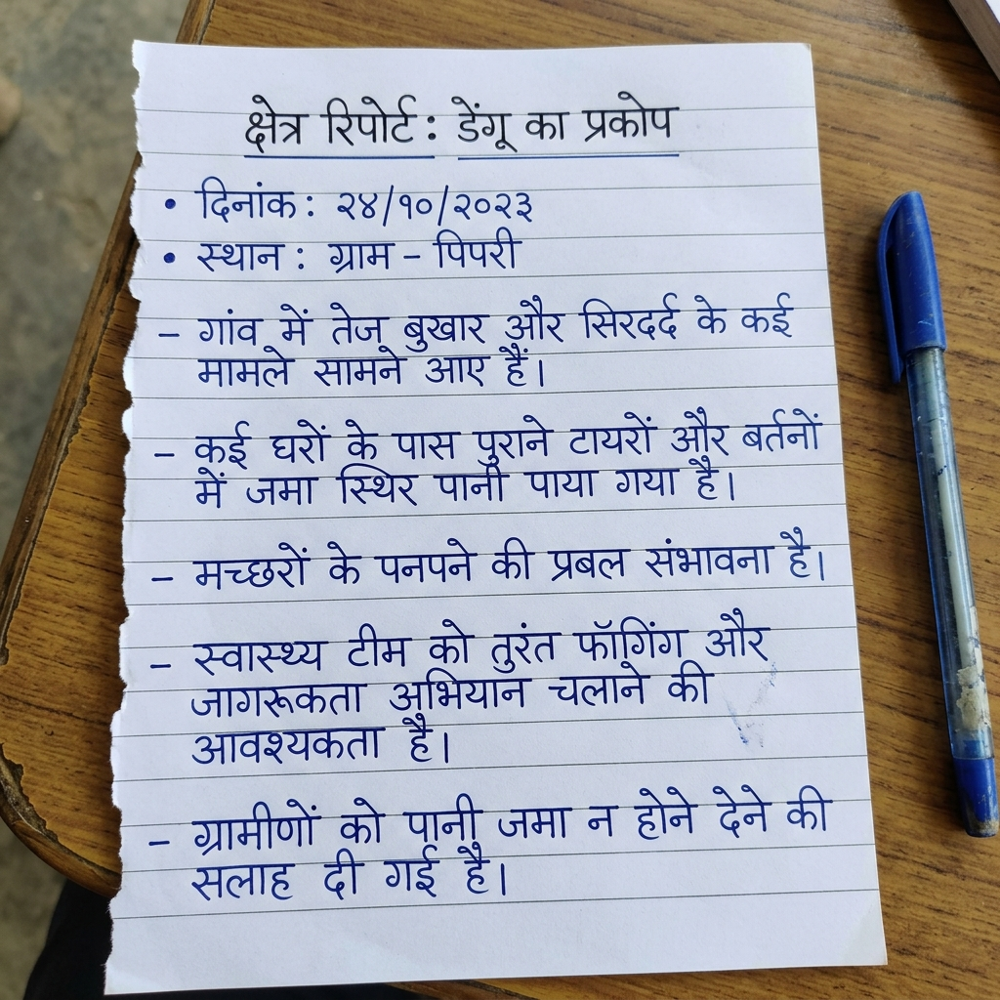
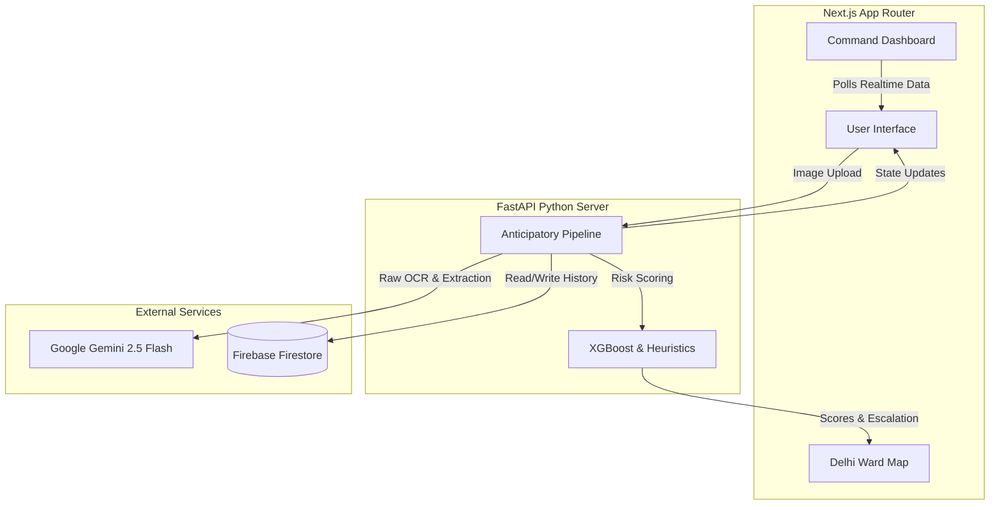
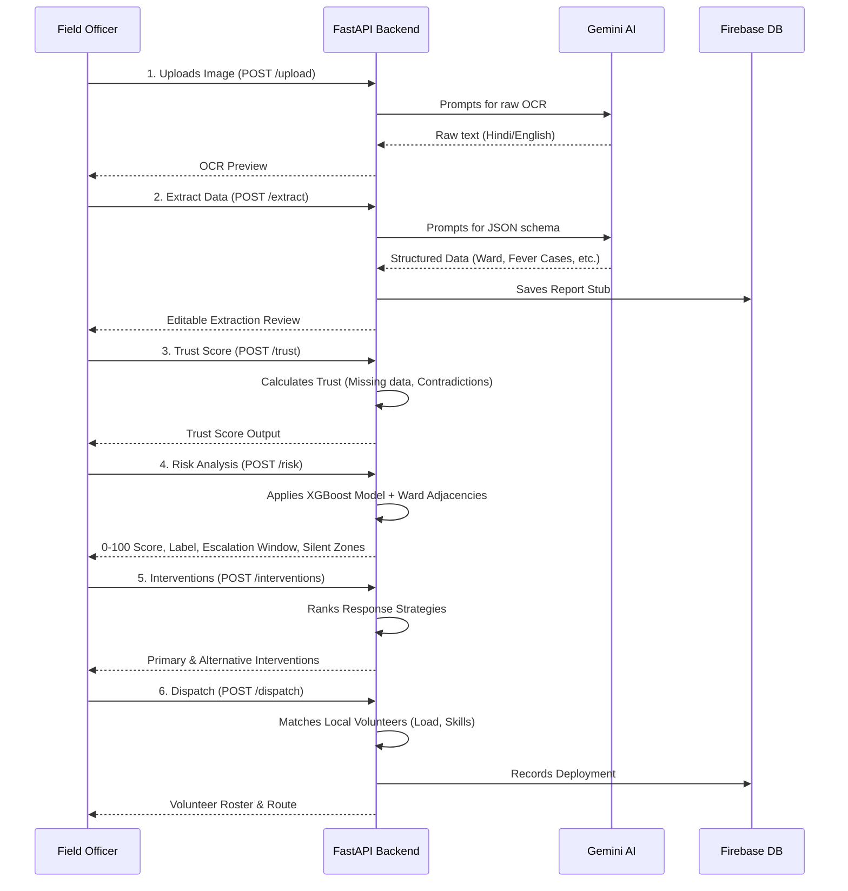

# ReliefOS — Anticipatory Action Engine 🌍

> **Paper-in → Intervention-out.** An AI pipeline that converts handwritten NGO field reports into real-time risk scores, intervention plans, and volunteer dispatch orders.


*(Handwritten Hindi field report sample processed by ReliefOS)*

---

## 📖 The Problem & Solution

### The Problem
During disasters (like the dengue season or monsoons), frontline NGOs collect invaluable data on paper. This data is critical for anticipating outbreaks, but digitizing it manually takes days. By the time the data is structured and analyzed, the "anticipatory window" closes, and the situation devolves into a reactive crisis response. 

### The Solution: ReliefOS
ReliefOS eliminates the digitization bottleneck. A field worker takes a photo of a messy, handwritten report (even in Hindi) and uploads it. ReliefOS instantly:
1. Translates and structures the data via AI.
2. Cross-references the data with historical rainfall and ward proximity to calculate an **Anticipatory Risk Score**.
3. Recommends specific interventions and dispatches the most appropriate local volunteers.

---

## 🧠 System Architecture

ReliefOS is built on a modern, scalable stack separating the AI-heavy analytical backend from the responsive dashboard frontend.



### Tech Stack
* **Frontend:** Next.js 14, React, Tailwind CSS, TypeScript (Deployed on Vercel)
* **Backend:** FastAPI, Pydantic, Python 3.10+ (Deployed on Render)
* **AI/ML:** Google Gemini 2.5 Flash (OCR + Extraction), XGBoost (Risk prediction model)
* **Database:** Firebase Firestore (Persistence & Feedback Loop)

---

## ⚙️ The Pipeline: Complete Working Flow

The core of ReliefOS is a 6-stage analytical pipeline. Each stage feeds into the next, transforming a raw image into actionable logistics.



### Stage Details
1. **Upload & OCR:** A field worker uploads a photo. The system uses **Gemini 2.5 Flash** natively to perform multimodal OCR, perfectly transcribing messy handwriting across multiple languages (including Hindi).
2. **Extraction:** Gemini structures the raw OCR text into a strict JSON schema, extracting metrics like `fever_cases`, `stagnant_water`, `households_surveyed`, and `urgency`. This stub is immediately saved to Firestore. Users get a human-in-the-loop review interface to correct any AI errors.
3. **Trust & Verification:** The system computes a **Trust Score (0-1)** using heuristics. It analyzes OCR confidence, missing field rates, contradictory symptom patterns, and cross-report agreement. A low trust score penalizes the risk severity to prevent false alarms.
4. **Risk Scoring Engine:** The core predictive layer. It feeds the extracted features into an **XGBoost regression model** to predict an anticipatory hotspot score (0-100). The model uses historical rain multipliers by ward, geographical adjacency, and symptom severity. If XGBoost is unavailable, it gracefully falls back to an expanded deterministic heuristic. It also calculates an **Escalation Clock** (estimating days until the situation worsens) and features **Silent Zone Detection** to flag quiet wards surrounded by high-risk outbreaks.
5. **Intervention Ranking:** Recommends the **Minimum Effective Intervention**—the smallest action likely to prevent escalation. It maps conditions to actions (e.g., "Deploy Fogging") using a deterministic ranking formula: `score = risk_severity × trust × intervention_fit / travel_cost`.
6. **Volunteer Swarm Dispatch:** An allocation algorithm matches local volunteers from the database based on geographical proximity, linguistic skills, current task load, and availability. It calculates ETAs and provides a task brief.

---

## ✨ Novelty Features

What sets ReliefOS apart from standard crisis dashboards:

* **The Escalation Clock:** Instead of just reporting current risk, ReliefOS predicts *when* the risk will escalate (e.g., "Medium risk today, will become High risk in 4 days if no action taken").
* **Trust Score Engine:** ReliefOS is "AI that knows its limitations." If a report is messy or contradictory, the Trust Score drops, preventing over-allocation of resources to bad data.
* **Evidence Trails:** Every AI-driven intervention includes an "Evidence Trail" panel. It explicitly tells the dispatcher *why* a decision was made, referencing key facts from the uploaded report.
* **Minimum Effective Intervention:** Optimized resource management that avoids sending an ambulance when a local health worker with basic medicine would suffice.
* **Silent-Zone Detection:** Cross-references `wards.json` adjacencies to find underreported "quiet" wards surrounded by active hotspots.

---

## 🚀 Advanced Features / Stretch Goals Completed

* ✅ **Silent-Zone Detection:** Cross-references `wards.json` adjacencies. If a ward spikes in risk, neighboring wards with zero recent reports are automatically flagged with a 🚨 UI alert.
* ✅ **Multilingual Field Processing:** Handles native Hindi scripts flawlessly using Gemini's native visual understanding capabilities.
* ✅ **Interactive Ward Map:** Real-time visual dashboard mapping risk scores and priority hotspots over an SVG-based outline of NCT Delhi.
* ✅ **Human-in-the-Loop Extraction:** Extracted variables are presented in a controlled React form, allowing operators to correct AI mistakes before finalizing the pipeline.

---

## 💻 Local Development

### 1. Backend Setup
```bash
cd backend
python -m venv venv
source venv/bin/activate  # (Windows: venv\Scripts\activate)
pip install -r requirements.txt

# Create .env file
echo "GEMINI_API_KEY=your_key_here" > .env
# Also add FIREBASE keys to .env (see Environment Variables section)

uvicorn main:app --reload
# Server runs on http://localhost:8000
```

### 2. Frontend Setup
```bash
cd frontend
npm install

# Create .env.local
echo "NEXT_PUBLIC_API_URL=http://localhost:8000" > .env.local

npm run dev
# App runs on http://localhost:3000
```

---

## ☁️ Deployment Guide

### Backend → Render
1. Push repo to GitHub.
2. Go to [render.com](https://render.com) → New Web Service.
3. **Root Directory:** `backend/`
4. **Build Command:** `pip install -r requirements.txt`
5. **Start Command:** `uvicorn main:app --host 0.0.0.0 --port $PORT`
6. Add the following **Environment Variables**:
   * `GEMINI_API_KEY`
   * `FIREBASE_PROJECT_ID`
   * `FIREBASE_CLIENT_EMAIL`
   * `FIREBASE_PRIVATE_KEY` *(Wrap the key in quotes to preserve `\n` linebreaks)*

### Frontend → Vercel
1. Go to [vercel.com](https://vercel.com) → New Project → Import from GitHub.
2. **Root Directory:** `frontend/`
3. Add **Environment Variable**:
   * `NEXT_PUBLIC_API_URL` → (Your Render backend URL, e.g., `https://relifos-api.onrender.com`)
4. Click Deploy.

---

## 🔐 Environment Variables

| Variable | Location | Purpose |
|---|---|---|
| `GEMINI_API_KEY` | Backend | Powers the OCR & Structured Extraction (Gemini 2.5 Flash) |
| `FIREBASE_PROJECT_ID` | Backend | Links to the Firestore database for deployments |
| `FIREBASE_CLIENT_EMAIL` | Backend | Firebase Admin Auth Service Account Email |
| `FIREBASE_PRIVATE_KEY` | Backend | Firebase Admin Auth Private Key |
| `NEXT_PUBLIC_API_URL` | Frontend | Connects Next.js to the FastAPI service |

---
*Built by Team Vectôr*
