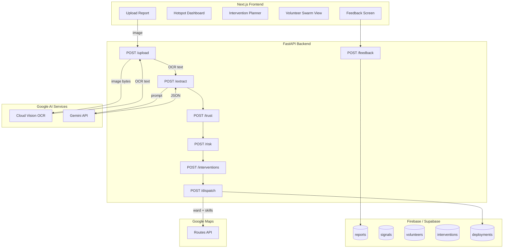

# ReliefOS — Implementation Plan

> **Paper-first anticipatory action engine** that reads handwritten field reports, scores their reliability, predicts escalation windows, and recommends the minimum effective intervention before a crisis spreads.

---

## Confirmed Technical Decisions

| Decision | Choice | Rationale |
|---|---|---|
| **Backend** | FastAPI (Python 3.11+) | Python-native for AI/ML layer (Vision, Gemini, scoring logic) |
| **Storage** | Firebase Firestore | Google-aligned for Google hackathon; free tier sufficient |
| **ETA** | Mocked (same=15min, adjacent=25min, far=40min) | No Maps key needed for demo; swap in Routes API if available |
| **Tailwind** | v3 | Stable, well-documented, no breaking changes |
| **Hosting** | Vercel (FE) + Render (BE) | Both free tier, fastest to deploy |

---

## Architecture Overview



---

## Tech Stack

| Layer | Technology | Purpose |
|---|---|---|
| **Frontend** | Next.js (App Router) | UI screens, routing |
| **Styling** | Tailwind CSS | Operational, clean UI |
| **Backend** | FastAPI (Python) | API layer, AI orchestration |
| **OCR** | Google Cloud Vision `DOCUMENT_TEXT_DETECTION` | Handwritten text extraction |
| **Extraction** | Gemini API / Vertex AI | OCR → structured JSON |
| **Maps / ETA** | Google Maps Routes API | Route planning, travel time |
| **Storage** | Firebase Firestore or Supabase | Reports, volunteers, deployments |
| **Risk Logic** | Python (local) | Weighted formula + escalation clock |
| **Trust Logic** | Python (local) | Heuristic confidence scoring |
| **Hosting (FE)** | Vercel or Firebase Hosting | Frontend deployment |
| **Hosting (BE)** | Render or Cloud Run | Backend deployment |

---

## Folder Structure

```
reliefos/
├── frontend/                       # Next.js app
│   ├── app/
│   │   ├── page.tsx                # Landing / Upload page
│   │   ├── layout.tsx              # Root layout
│   │   ├── upload/
│   │   │   └── page.tsx            # Upload flow UI
│   │   ├── dashboard/
│   │   │   └── page.tsx            # Hotspot dashboard (risk-ranked wards)
│   │   ├── intervention/
│   │   │   └── page.tsx            # Intervention planner
│   │   ├── dispatch/
│   │   │   └── page.tsx            # Volunteer swarm view
│   │   ├── feedback/
│   │   │   └── page.tsx            # Feedback screen
│   │   └── components/
│   │       ├── UploadDropzone.tsx
│   │       ├── OcrPreview.tsx
│   │       ├── ExtractionReview.tsx
│   │       ├── TrustBadge.tsx
│   │       ├── RiskGauge.tsx
│   │       ├── EscalationClock.tsx
│   │       ├── EvidenceTrail.tsx
│   │       ├── InterventionCard.tsx
│   │       ├── DispatchPanel.tsx
│   │       ├── FeedbackForm.tsx
│   │       ├── StepProgress.tsx
│   │       └── Layout/
│   │           ├── Header.tsx
│   │           └── Footer.tsx
│   ├── styles/
│   │   └── globals.css
│   ├── tailwind.config.ts
│   ├── next.config.js
│   ├── tsconfig.json
│   └── package.json
│
├── backend/                        # FastAPI app
│   ├── main.py                     # FastAPI entrypoint + CORS
│   ├── models.py                   # Pydantic models (shared schemas)
│   ├── routers/
│   │   ├── upload.py               # POST /upload (OCR)
│   │   ├── extract.py              # POST /extract (Gemini)
│   │   ├── trust.py                # POST /trust
│   │   ├── risk.py                 # POST /risk
│   │   ├── interventions.py        # POST /interventions
│   │   ├── dispatch.py             # POST /dispatch
│   │   └── feedback.py             # POST /feedback
│   ├── lib/
│   │   ├── vision.py               # Cloud Vision wrapper
│   │   ├── gemini.py               # Gemini extraction + prompt
│   │   ├── trust.py                # Trust scoring heuristics
│   │   ├── risk.py                 # Risk formula + escalation clock
│   │   ├── interventions.py        # Rule-based ranking
│   │   ├── volunteers.py           # Team matching logic
│   │   └── eta.py                  # Mocked ETA (swap for Routes API later)
│   ├── data/
│   │   ├── volunteers.json         # Mock volunteer data
│   │   ├── wards.json              # Ward metadata + rain multipliers
│   │   └── sample-reports.json     # Seeded sample reports
│   ├── requirements.txt
│   └── .env
│
├── public/
│   └── sample-reports/             # Sample handwritten report images
│
└── README.md
```

---

## System Modules (8 total)

### 1. Ingestion (`upload.py` + `vision.py`)
- Accept image upload (multipart form)
- Send to Google Cloud Vision `DOCUMENT_TEXT_DETECTION`
- Return raw OCR text + block confidence
- Store report stub in Firebase

### 2. Extraction (`extract.py` + `gemini.py`)
- Send OCR text to Gemini with strict schema prompt
- Validate returned JSON against `ExtractedReport` schema
- Handle: malformed JSON, missing fields, low confidence
- Optional: pass image context alongside OCR text for multimodal extraction

### 3. Trust Scoring (`trust.py`)
- Compute trust score (0–1) using heuristics:
  - OCR confidence from Vision API
  - Missing field rate (null fields / total fields)
  - Repeated evidence patterns (same symptoms across fields)
  - Report recency weighting
  - Cross-report agreement (if same ward has other recent reports)
- Return: `{ trust_score, confidence_label, factors[] }`

### 4. Risk Engine (`risk.py`)
- Weighted formula fusing extracted data + external signals:
  - fever_cases, stagnant_water, water_contamination, medicine_shortage, urgency
  - Ward-level rain multiplier
  - Cross-report corroboration bonus
- Produce hotspot score (0–100) + risk label
- **Escalation clock**: estimate days-to-escalation based on signal trajectory
  - e.g., "Likely to escalate from Medium to High in ~4 days if no action taken"
- Return: `{ score, label, explanation, escalation_window }`

### 5. Intervention Recommender (`interventions.py`)
- Deterministic rules table mapping conditions → actions
- Ranking formula: `score = risk_severity × trust × intervention_fit / travel_cost`
- **Minimum Effective Intervention**: recommend the smallest action likely to prevent escalation
- Return: top recommendation + 2 backups, each with title, rationale, urgency, team composition

### 6. Swarm Allocation (`volunteers.py` + `eta.py`)
- Match volunteers from `data/volunteers.json` by: skill, area, availability, language, load
- Compute ETA via mocked distance-based logic (same ward = 15 min, adjacent = 25 min, far = 40 min)
- Assign micro-team of 3–5 volunteers
- Return: `{ team[], task_brief, eta_minutes, route_summary }`

### 7. Explanation Layer (integrated across modules)
- **Evidence Trail** panel: "Why this decision?"
  - Key facts from report
  - Corroborating context signals
  - Reason intervention was chosen
- Plain-language explanations on every recommendation

### 8. Feedback Loop (`feedback.py`)
- Accept post-task feedback: people reached, resolved y/n, remaining issues
- Update deployment status in Firebase
- Slightly adjust area risk score based on outcome

---

## Database Schema (Firebase/Supabase)

### `reports`
| Field | Type | Description |
|---|---|---|
| report_id | string | Auto-generated |
| image_url | string | Uploaded image location |
| raw_ocr_text | string | Vision API output |
| extracted_json | object | Gemini structured output |
| trust_score | float | 0–1 confidence |
| risk_score | int | 0–100 hotspot score |
| escalation_window | string | e.g., "4 days" |
| ward | string | Delhi ward name |
| lat / lng | float | Geo coordinates |
| timestamp | datetime | Upload time |

### `signals`
| Field | Type |
|---|---|
| ward | string |
| date | date |
| rainfall_mm | float |
| context_features | object |

### `volunteers`
| Field | Type |
|---|---|
| name | string |
| skills | string[] |
| home_location | string |
| availability | boolean |
| language | string |
| current_load | int |

### `interventions`
| Field | Type |
|---|---|
| type | string |
| trigger_conditions | object |
| recommended_skill_mix | string[] |
| expected_impact_score | float |

### `deployments`
| Field | Type |
|---|---|
| deployment_id | string |
| report_id | string (FK) |
| assigned_volunteers | string[] |
| target_zone | string |
| route_eta | int (minutes) |
| status | enum: pending/active/completed |
| feedback_summary | object |

---

## UI Screens (5 total)

### 1. Upload Report
- Drag-and-drop image uploader
- Image preview
- "Analyze Report" button
- Sample report quick-load buttons
- After submit: show OCR text + extracted JSON + trust badge inline

### 2. Hotspot Dashboard
- Risk-ranked ward cards (score, label, escalation clock)
- Ward list sorted by severity
- **Silent-zone flags** for underreported areas (if time)
- Click ward → see contributing reports

### 3. Intervention Planner
- Primary recommendation card (highlighted)
- 2 backup/alternative cards
- Each card: title, rationale, urgency, minimum team needed
- **Evidence Trail** panel: "Why this decision?"

### 4. Volunteer Swarm View
- Assigned micro-team cards (name, skills, area, language)
- Task brief summary
- ETA display
- Route summary (mock or real)
- "Confirm Dispatch" button → success state

### 5. Feedback Screen
- Post-task form: people reached, resolved y/n, remaining issues
- Photo/note upload
- Submit → updates deployment status + adjusts ward risk

---

## Novelty Features (ranked by priority)

| # | Feature | Impact | Effort | Priority |
|---|---|---|---|---|
| 1 | **Trust Score Engine** | High — shows AI awareness of its own limitations | Low | ⭐ Must-have |
| 2 | **Escalation Clock** | High — makes risk score dynamic and anticipatory | Low–Med | ⭐ Must-have |
| 3 | **Evidence Trail** | High — explainability is a strong differentiator | Low | ⭐ Must-have |
| 4 | Minimum Effective Intervention | Med — resource optimization angle | Low | Nice-to-have |
| 5 | Silent-Zone Detection | Med — anticipatory credibility | Med | Stretch |

---

## Compressed 2-Day Build Plan

### Day 1 — Pipeline + Core UI
| # | Task | Owner |
|---|---|---|
| 1 | Initialize Next.js frontend + Tailwind | Frontend |
| 2 | Initialize FastAPI backend + project structure | Backend |
| 3 | Set up Firebase/Supabase collections | Backend |
| 4 | Define TypeScript types + Python models | Both |
| 5 | Build Upload Page UI (dropzone, preview) | Frontend |
| 6 | Implement `vision.py` + `POST /upload` | Backend (AI) |
| 7 | Implement `gemini.py` + `POST /extract` | Backend (AI) |
| 8 | Implement `trust.py` + `POST /trust` | Backend (AI) |
| 9 | Wire upload → OCR → extraction → trust flow | Integration |
| 10 | Create `data/volunteers.json`, `data/wards.json` | Data |

### Day 2 — Intelligence + Polish + Demo
| # | Task | Owner |
|---|---|---|
| 11 | Implement `risk.py` + escalation clock + `POST /risk` | Backend |
| 12 | Build Hotspot Dashboard screen | Frontend |
| 13 | Implement `interventions.py` + `POST /interventions` | Backend |
| 14 | Build Intervention Planner screen + Evidence Trail | Frontend |
| 15 | Implement `volunteers.py` + `eta.py` + `POST /dispatch` | Backend |
| 16 | Build Volunteer Swarm View screen | Frontend |
| 17 | Build Feedback screen + `POST /feedback` | Both |
| 18 | Seed 3 sample reports in `/public/sample-reports/` | Data |
| 19 | End-to-end demo walkthrough | QA |
| 20 | Record demo video + prepare submission | Product |

---

## Demo Script

1. Upload a handwritten Delhi field report
2. Show OCR text extraction
3. Show structured fields + **trust score**
4. Show hotspot risk score + **escalation clock**
5. Show intervention recommendation + **evidence trail**
6. Show volunteer swarm dispatched with ETA
7. Submit feedback → show hotspot score improve

---

## Definition of Done

The MVP is complete when:
- ✅ User uploads a handwritten report
- ✅ OCR text appears
- ✅ Structured JSON appears
- ✅ Trust score appears
- ✅ Hotspot risk score appears
- ✅ Escalation window appears
- ✅ Intervention recommendation appears
- ✅ Volunteer team appears as dispatched

Everything beyond this is optional.

---

## Environment Variables

```env
# Backend (.env)
GOOGLE_CLOUD_VISION_API_KEY=...
GEMINI_API_KEY=...
GOOGLE_MAPS_API_KEY=...
FIREBASE_PROJECT_ID=...
FIREBASE_PRIVATE_KEY=...
FIREBASE_CLIENT_EMAIL=...

# Frontend (.env.local)
NEXT_PUBLIC_API_URL=http://localhost:8000
```

---

## Environment Variables

```env
# Backend (.env)
GOOGLE_CLOUD_VISION_API_KEY=...
GEMINI_API_KEY=...
FIREBASE_PROJECT_ID=...
FIREBASE_PRIVATE_KEY=...
FIREBASE_CLIENT_EMAIL=...
# Optional — only needed if swapping in real Maps routing:
# GOOGLE_MAPS_API_KEY=...

# Frontend (.env.local)
NEXT_PUBLIC_API_URL=http://localhost:8000
```
